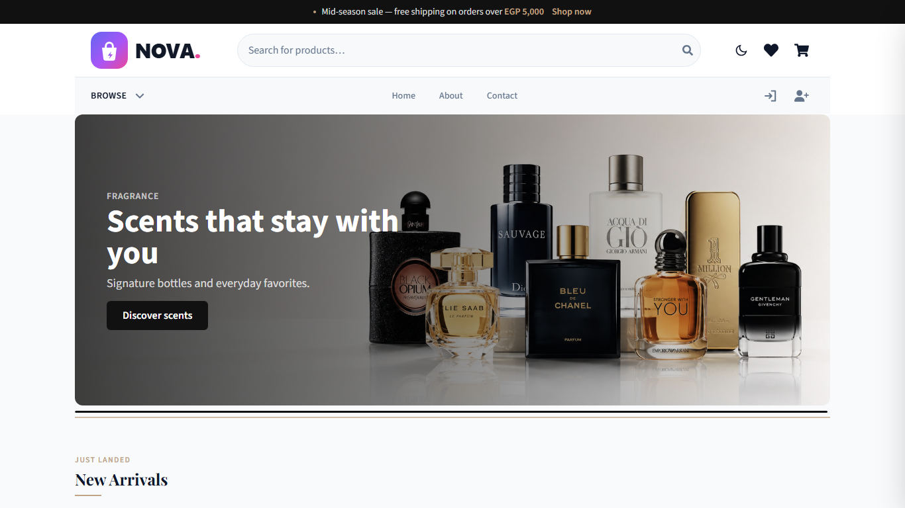
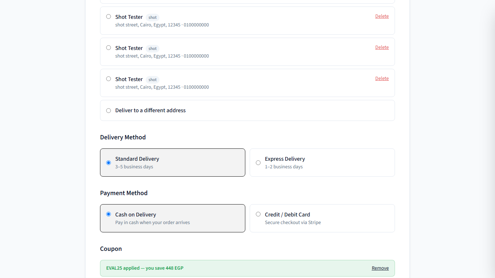
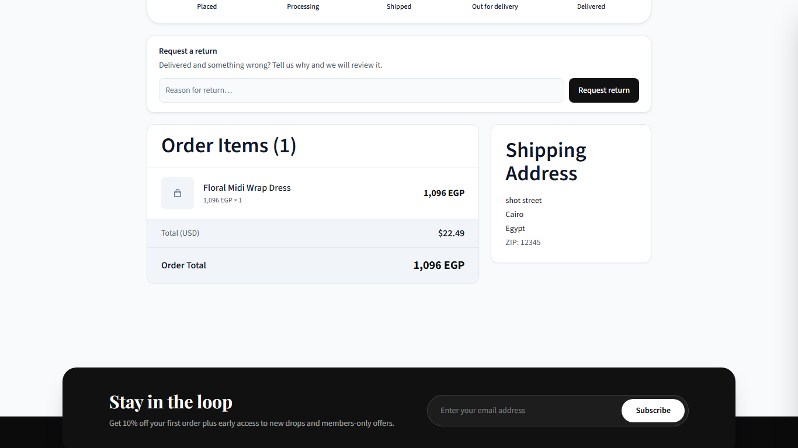
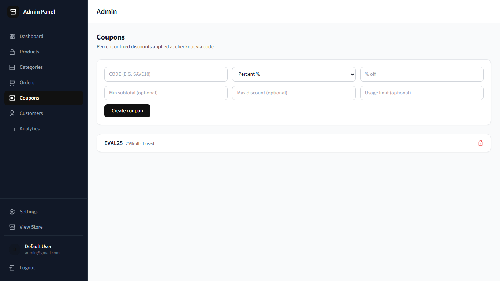
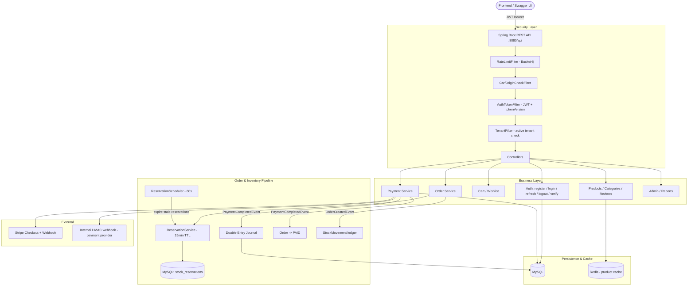
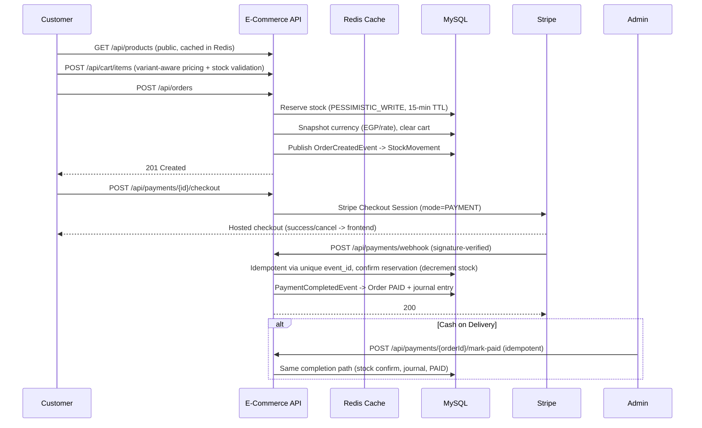
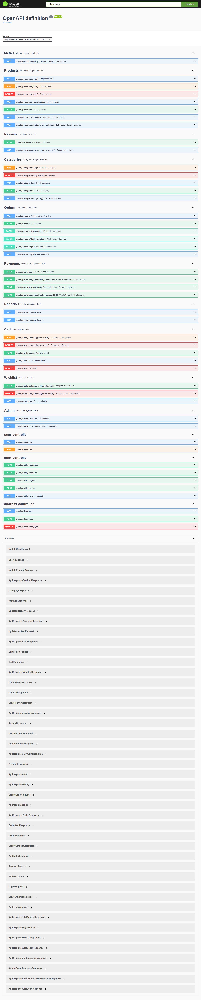
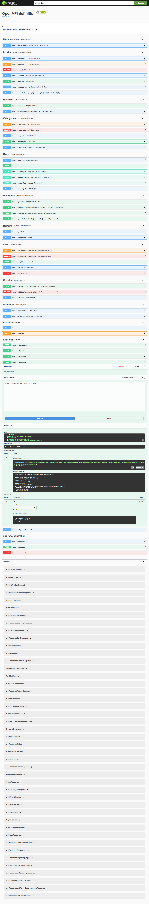
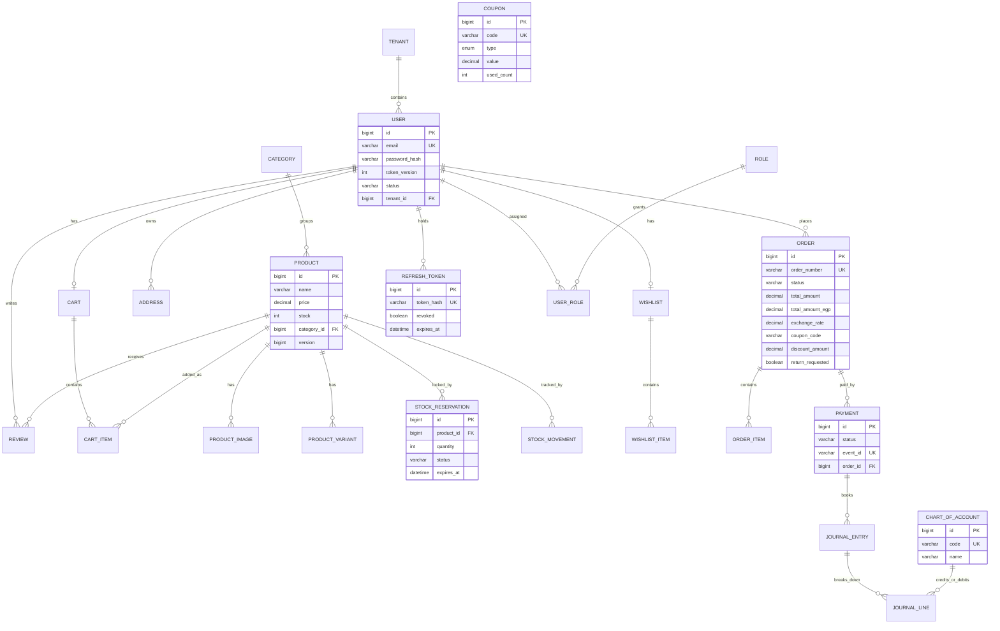
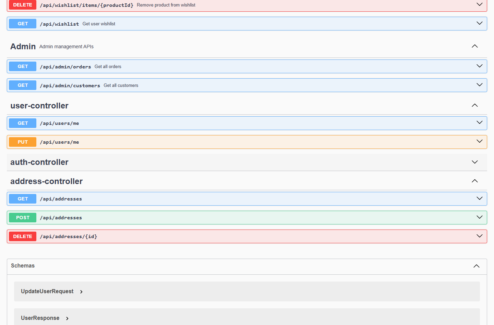

<div align="center">


<br/>

**Every order counts.**
A production-oriented REST API for a multi-tenant e-commerce platform — catalog, cart, stock reservations, Stripe/COD payments, double-entry accounting, and analytics — with security enforced at every layer.

🎬 **Video tour (3 min):** https://youtu.be/d2A5RyFmRRE — full frontend walkthrough (storefront, checkout with coupon, orders + returns, admin dashboard, coupons, analytics).

<br/>


[](#-system-architecture)
[](#-security)
[](#-payments)

</div>

---

## 📋 Table of Contents

- [Overview](#-overview)
- [Demo Video & UI Tour](#-demo-video--ui-tour)
- [System Architecture](#-system-architecture)
- [Order Lifecycle](#-order-lifecycle)
- [Features](#-features)
- [API Reference](#-api-reference)
- [Database Schema](#-database-schema)
- [Tech Stack](#-tech-stack)
- [Security](#-security)
- [Known Limitations](#-known-limitations)
- [Getting Started](#-getting-started)
- [Author](#-author)

---

## 🌐 Overview

**E-Commerce API** is a full-order-lifecycle backend: a customer browses a cached catalog, fills a cart, places an order that **reserves real stock**, pays through Stripe Checkout (or cash-on-delivery), and triggers idempotent webhooks, stock confirmations, and double-entry accounting — all inside a multi-tenant boundary.

### Design decisions that go beyond a typical CRUD API

| Challenge | How it's solved |
|---|---|
| A stolen or leaked access token keeps working until it expires | **Token versioning** — `user.tokenVersion` is embedded in the JWT and checked on every request; incrementing it instantly invalidates every outstanding access token |
| Refresh tokens are a classic database time-bomb | Refresh tokens are opaque UUIDs stored **SHA-256-hashed with an indexed column** — rotation/validation is a single indexed lookup (O(1)), not a table scan of active tokens |
| Attackers replay stolen refresh cookies from another origin | The **CSRF origin-check filter** rejects any cookie-authenticated `refresh`/`logout` that doesn't carry an allowed `Origin`/`Referer`; tokens are httpOnly with SameSite + Secure configurable per profile |
| Brute-forcing login/register/refresh | **Bucket4j per-IP, per-endpoint rate limiting** returns a 429 JSON envelope after the burst capacity is exceeded |
| Overselling products under concurrent checkout | **Pessimistic locking** (`SELECT ... FOR UPDATE`) on stock + 15-minute **stock reservations** + optimistic retry (×3); a 20-thread and a 1000-user test prove exactly the right number of sales succeed |
| Webhooks are either spoofable or fragile | Two verified paths — **Stripe SDK signature verification** plus an **HMAC-SHA256 internal webhook** with 5-minute timestamp freshness; both are **idempotent** via a unique `event_id` constraint |
| Replaying a "mark as paid" or a webhook payment | Idempotency everywhere — COD `mark-paid` no-ops on repeat, re-verifying email no-ops, payment events keyed by unique `event_id` |
| USD-charged Stripe payments vs EGP display prices drift apart | Every order stores a **currency snapshot** (`total_amount_egp`, `exchange_rate`, `exchange_rate_at`) so what the customer paid and what the books show always reconcile |
| Accounting must match reality after money moves | A **finance event listener** writes a double-entry journal — debit Accounts Receivable (1100), credit Sales Revenue (4000) — the moment a payment completes |
| Multi-tenant data must never leak across tenants | `tenant_id` on every business table + a **Hibernate `@Filter` enabled by an AOP aspect** before every repository call + a `TenantFilter` that rejects requests for inactive tenants |
| Slow catalog reads on a hot public API | **Redis-backed product caching** with 10-minute TTL and targeted cache eviction on writes |
| Soft-deleting catalog rows without breaking history | `@Where(is_deleted = false)` soft deletes, so order/review history stays intact while catalog reads stay clean |
| Discounts without a coupon engine | `Coupon` entity (`V8__coupons.sql`): PERCENT/FIXED, min-subtotal, max-discount cap, date window, usage limit — validated + consumed inside the order transaction, previewable via `GET /api/coupons/validate` |
| Product images with no upload backend | `POST /api/uploads` stores validated images (type/size-checked, UUID names) on local disk served at `/uploads/**` (public GET, ADMIN/VENDOR writes) |
| Delivered orders with no return path | Customer `POST /api/orders/{id}/return` (DELIVERED only) → admin `POST /api/orders/{id}/approve-return` (→ REFUNDED) |

---

## 🎬 Demo Video & UI Tour

**Watch (3 min):** https://youtu.be/d2A5RyFmRRE — storefront, checkout with coupon, orders + return request, admin dashboard / coupons / analytics.

<p align="center">
  
</p>
<p align="center">
  
</p>
<p align="center">
  
</p>
<p align="center">
  
</p>

---

## 🏗️ System Architecture



**Notes:**
- All security enforcement — rate limiting, CSRF origin check, JWT validation + token versioning, and tenant activation — runs **before** any controller logic.
- The API is **stateless** for access (JWT Bearer); refresh tokens are the only stateful credential, kept out of JavaScript in an httpOnly cookie.
- Redis serves the product-cache layer; MySQL holds everything else under Flyway-managed schema with `ddl-auto: validate`.

---

## 🔄 Order Lifecycle



<!-- ===== SCREENSHOT SLOT: Swagger UI overview =====
     Captured live from the running API. Regenerate anytime with the app up. -->
<p align="center">
  
</p>

---

## ✨ Features

### 🔐 Auth & Security
- JWT access tokens (24h) + **rotating refresh tokens in httpOnly cookies** (7-day TTL)
- Refresh tokens stored **SHA-256-hashed with indexed lookup** — rotation is instant even with thousands of sessions
- **Token versioning** — bump `tokenVersion` to revoke every outstanding access token at once
- BCrypt password hashing, email verification (24h token, idempotent), dev auto-verify flag
- **CSRF origin check** on cookie-authenticated endpoints, **Bucket4j rate limiting** on auth endpoints
- Role-based access control (CUSTOMER / ADMIN / WAREHOUSE / ACCOUNTANT / VENDOR) via `@PreAuthorize`

### 🏢 Multi-Tenancy
- `Tenant` entity + `tenant_id` on every business table
- Hibernate `@Filter(tenantFilter)` enabled by an **AOP aspect** before each repository call
- `TenantFilter` rejects requests for inactive tenants; `TenantContext` ThreadLocal, cleared on completion

### 🛒 Catalog & Cart
- Products with variants, images, categories; paginated public browsing + search (name / price range / category / in-stock)
- JPA Specification search, **Redis product caching** with 10-minute TTL and eviction on write
- Variant-aware cart pricing with stock validation; wishlist; soft-deleted catalog rows stay out of reads
- Product reviews — one review per user+product, only approved reviews are public
- **Image uploads** — `POST /api/uploads` (ADMIN/VENDOR, 5MB image check) served publicly at `/uploads/**`; admin product modal supports upload or URL

### 🏷️ Coupons & Discounts
- `Coupon` entity: PERCENT/FIXED value, min-subtotal, max-discount cap, active flag, start/end window, usage limit/counter
- `POST /api/orders` accepts `couponCode` — validated and consumed atomically inside the order transaction, before the currency snapshot
- `GET /api/coupons/validate?code=&subtotal=` previews the discount without consuming it; admin CRUD at `/api/coupons` (+ `/admin/coupons` UI)

### 📦 Orders & Inventory
- Order creation from cart with **stock reservation** (15-min TTL, `PESSIMISTIC_WRITE` + optimistic retry)
- Ship / deliver / cancel lifecycle (cancel releases reservations)
- **Returns** — customer requests on DELIVERED orders, admin approves (→ REFUNDED); both sides have UI (order detail + admin order detail)
- `StockMovement` ledger on order creation and payment confirmation
- **ReservationScheduler** expires stale reservations every 60s

### 💳 Payments
- **Stripe Checkout Session** (`mode=PAYMENT`) with success/cancel URLs on the frontend
- **Stripe webhook** verified with the SDK; **internal HMAC webhook** with 5-minute timestamp freshness; ambiguous signatures rejected with 403
- **Cash-on-delivery** with idempotent admin `mark-paid`
- **Idempotent everywhere** — unique `event_id` constraint on payment events, replay-safe
- **Currency snapshot** per order (USD charged vs EGP displayed) for reconcilable books

### 📊 Finance & Reporting
- **Double-entry journaling** on payment completion — debit AR (1100), credit Sales Revenue (4000)
- Revenue & dashboard aggregates (revenue, order count, average order value) over date ranges for ADMIN / ACCOUNTANT
- **CSV export** — `GET /api/admin/orders/export` (same filters as the listing, capped at 5000 rows) and `GET /api/reports/dashboard/export`; buttons in admin Orders/Analytics pages

### 📡 Observability
- MDC `traceId` / `userId` / `tenantId`, Logstash JSON console logging
- Spring Boot Actuator (health / info / metrics), mail health indicator that fails loudly in prod
- springdoc OpenAPI / Swagger UI, MapStruct mappers, JPA auditing (`AuditorAware`)

---

## 📡 API Reference

57 endpoints across 15 controllers, all under the `/api` context-path · Full interactive docs at `/swagger-ui/index.html`

<!-- ===== SCREENSHOT SLOT: live login execution =====
     POST /api/auth/login executed from Swagger UI - 200 with access token. -->
<p align="center">
  
</p>

| Method | Endpoint | Role | Description |
|---|---|---|---|
| `POST` | `/api/auth/register` | Public | Register a customer + email verification |
| `POST` | `/api/auth/login` | Public | Login → access token + httpOnly refresh cookie |
| `POST` | `/api/auth/refresh` | Public | Rotate the refresh cookie (origin-checked) |
| `POST` | `/api/auth/logout` | Public | Revoke the refresh token |
| `GET` | `/api/products` | Public | Paginated catalog (+ search/filters) |
| `POST` | `/api/products` | ADMIN / VENDOR | Create product |
| `GET` | `/api/orders` | CUSTOMER | My orders |
| `POST` | `/api/orders` | CUSTOMER | Create order from cart (reserves stock) |
| `POST` | `/api/payments` | Authenticated | Create payment for an order |
| `POST` | `/api/payments/checkout/{paymentId}` | Owner | Stripe Checkout Session URL |
| `POST` | `/api/payments/webhook` | Public | Stripe / internal HMAC webhook |
| `POST` | `/api/payments/{orderId}/mark-paid` | ADMIN | COD mark-paid (idempotent) |
| `GET` | `/api/admin/orders` | ADMIN / WAREHOUSE | All-orders summary |
| `GET` | `/api/admin/orders/export` | ADMIN / WAREHOUSE | Same filters as CSV download (cap 5000) |
| `GET` | `/api/admin/customers` | ADMIN | Customer list |
| `GET` | `/api/reports/dashboard` | ADMIN / ACCOUNTANT | Revenue, orders, avg order value |
| `GET` | `/api/reports/dashboard/export` | ADMIN / ACCOUNTANT | Dashboard row as CSV |
| `GET` | `/api/coupons/validate` | Authenticated | Preview discount without consuming |
| `POST` | `/api/coupons` | ADMIN | Create coupon |
| `POST` | `/api/uploads` | ADMIN / VENDOR | Upload product image (multipart) |
| `POST` | `/api/orders/{id}/return` | CUSTOMER | Request return (DELIVERED only) |
| `POST` | `/api/orders/{id}/approve-return` | ADMIN / WAREHOUSE | Approve return (→ REFUNDED) |
| `GET` | `/api/users/me` | Authenticated | Current user profile |

<details>
<summary><b>📂 See all 57 endpoints (grouped by controller)</b></summary>

**AuthController** `/api/auth` — register, login, refresh, logout, verify-email (5)
**ProductController** `/api/products` — create, update, soft-delete, get-by-id, paginated list, by-category, search (7)
**CategoryController** `/api/categories` — list, by-slug, create, update, soft-delete (5)
**CartController** `/api/cart` — get, add item, update item, remove item, clear (5)
**WishlistController** `/api/wishlist` — get, add item, remove item (3)
**OrderController** `/api/orders` — create, list, get-by-id (ownership-checked), ship, deliver, cancel, request-return, approve-return (8)
**PaymentController** `/api/payments` — create, Stripe checkout, COD mark-paid, webhook (4)
**CouponController** `/api/coupons` — create, update, delete, list, validate (5)
**UploadController** `/api/uploads` — image upload (1)
**AdminController** `/api/admin` — orders, orders export (CSV), customers (3)
**ReportController** `/api/reports` — revenue, dashboard, dashboard export (CSV) (3)
**UserController** `/api/users` — me, update me (2)
**AddressController** `/api/addresses` — create, list, delete (3)
**ReviewController** `/api/reviews` — create (unique per user+product), public approved list (2)
**MetaController** `/api/meta` — currency display rate (1)

</details>

<details>
<summary><b>📸 Sample: place an order and pay</b></summary>

```jsonc
// POST /api/orders
// Authorization: Bearer <customer-token>

{
  "addressId": 4,
  "items": [
    { "productId": 2, "quantity": 2, "variantId": 11 }
  ]
}
```

```json
// 201 Created - stock reserved, cart cleared
{
  "id": 41,
  "orderNumber": "6341b8e8-f903-4851-8d70-777332d830c6",
  "status": "PENDING",
  "totalAmount": 130.00,
  "totalAmountEgp": 6337.50,
  "exchangeRate": 48.75
}
```

</details>

<details>
<summary><b>📸 Sample: webhook marks the order paid</b></summary>

```jsonc
// POST /api/payments/webhook   (internal HMAC path)
// Headers: X-Timestamp: <unix-seconds>, X-Signature: HMAC-SHA256(timestamp.payload)

{
  "eventId": "evt_0f2a...9c",
  "paymentId": 41,
  "status": "COMPLETED"
}
```

```json
// 200 OK - idempotent (replay with the same eventId no-ops)
{
  "success": true,
  "message": "Webhook processed"
}
```

</details>

---

## 🗄️ Database Schema

 24 domain entities + an embedded `AddressSnapshot`, 10 Flyway migrations (`V1__baseline.sql` … `V7__performance_indexes.sql`, `V8__coupons.sql`, `V9__order_returns.sql`, `V10__coupon_type_enum.sql`) · `ddl-auto: validate` with Flyway-managed schema:



---

## 🛠️ Tech Stack

| Layer | Technology | Notes |
|---|---|---|
| Language | Java 21 | Core language |
| Framework | Spring Boot 3.2.5 | Application framework |
| Security | Spring Security + jjwt 0.11.5 | JWT access + refresh rotation, `@PreAuthorize` |
| Persistence | Spring Data JPA / Hibernate | `ddl-auto: validate`, Flyway-managed schema |
| Database | MySQL 8 | via `docker-compose` (host port 3307) |
| Cache | Redis 7 | Product caching (10-min TTL) |
| Payments | Stripe 25.2.0 | Checkout Sessions + signature-verified webhooks |
| Rate Limiting | Bucket4j 8.10.1 | Per-IP, per-endpoint on auth endpoints |
| Accounting | Double-entry journaling | AR 1100 / Revenue 4000 on payment completion |
| Docs | springdoc OpenAPI 2.5.0 | Swagger UI |
| Mapping | MapStruct 1.5.5 | DTO mappers (10) |
| Logging | Logstash Logback Encoder | JSON console logs with traceId/userId/tenantId |
| Monitoring | Spring Boot Actuator | health / info / metrics |
| Testing | JUnit 5, TestRestTemplate | 37 tests incl. 1000-user load + concurrency |
| Build | Maven | Dependency management |

---

## 🔒 Security

Enforced across three layers — filter chain, tenancy, and service-level idempotency:

- **Stateless JWT access tokens** (24h) with `tokenVersion` check on every request
- **Rotating refresh tokens** in httpOnly cookies — SHA-256-hashed in the DB, indexed lookup, rotated on every refresh, revoked on logout
- **Instant global revocation** — increment `user.tokenVersion` and every outstanding access token dies
- **CSRF origin check** — cookie-authenticated `refresh`/`logout` require a matching `Origin` (fallback `Referer`); cross-site attempts → 403
- **Bucket4j rate limiting** on login / register / refresh (429 after burst)
- **Multi-tenant isolation** — Hibernate `@Filter` enabled via AOP before each repository call; `TenantFilter` rejects inactive tenants
- **Ownership checks** — orders, payments, addresses, carts are owner-scoped (cross-user access → 401/403)
- **Idempotency** — unique `event_id` on payment webhooks, replay-safe COD `mark-paid`, re-verify no-ops
- **Concurrency safety** — `PESSIMISTIC_WRITE` locks + optimistic retry (×3) on stock; tested with 20 threads and 1000 users (exactly no oversell)
- **Soft deletes + JPA auditing** — history preserved, tenant & user recorded on every write

<!-- Real Swagger UI auth controller - register / login / refresh / logout / verify-email -->
<p align="center">
  
</p>

---

## Known Limitations

| Limitation | Detail |
|---|---|
| Manual DB edits vs cache | Catalog reads (products/product_images/categories) are served from the **Redis product cache** (`products_page`, `products`, `products_search` keys). Any direct SQL change to catalog tables is invisible to the API until the cache is cleared — run `redis-cli FLUSHALL` (or restart the app) after manual edits |
| File uploads | Product images upload to local disk (`./uploads`, served at `/uploads/**` via `POST /api/uploads`); configure `app.upload.dir` + reverse-proxy caching before production |
| Coupons / discounts | Coupon engine implemented (`Coupon` entity, `V8__coupons.sql`): percent/fixed, min-subtotal, date window, usage cap; applied at order creation via `couponCode`, admin CRUD at `/api/coupons` |
| Password reset | Fully implemented: `POST /api/auth/forgot-password` (anti-enumeration) + `POST /api/auth/reset-password` (single-use, expiring token) + authenticated change at `POST /api/users/me/password` |
| Reservation expiry job | `ReservationScheduler` runs every 60s (`@EnableScheduling` on the application class) and releases stale reservations |
| Returns | Customer return requests (`POST /api/orders/{id}/return`, DELIVERED only) with `return_requested/return_reason`; admin approves via `POST /api/orders/{id}/approve-return` (→ REFUNDED) |
| CSV export | Admin orders (`GET /api/admin/orders/export`) and dashboard (`GET /api/reports/dashboard/export`) stream `text/csv`; export buttons in admin Orders/Analytics pages |
| Prod email sending | SMTP wiring exists and dev logs emails instead of sending; a real mail provider must be configured before production |
| Caching scope | Redis product cache is single-store, not distributed across app instances |
| Checkout webhooks | Internal webhook requires a payment provider that supports HMAC signing; Stripe uses its own SDK-verified path |

---

## 🚀 Getting Started

### Prerequisites
- JDK 21, Maven 3.9+
- MySQL 8 + Redis (or `docker compose up -d mysql redis`)
- Node.js 20+ (frontend, optional)

### Backend — quick start

```bash
git clone <repo-url>
cd ecommerce-backend

# 1. Provide local secrets (copy the example, fill in DB creds + JWT secret)
cp .env.example .env

# 2. Start infra (optional - MySQL + Redis via Docker)
docker compose up -d mysql redis

# 3. Run the API
./mvnw spring-boot:run
```

Starts on `http://localhost:8080`:
- Swagger UI → `http://localhost:8080/swagger-ui/index.html`
- OpenAPI JSON → `http://localhost:8080/v3/api-docs`
- Actuator health → `http://localhost:8080/actuator/health`

Seeded on first run (`DataInitializer`): SYSTEM tenant, all roles, and two accounts — `admin@gmail.com` and `user@gmail.com`, both with password `123456`.

### Frontend (optional)

```bash
cd ../E-Commerce-frontend
npm install
npm run dev   # http://localhost:5173, proxies /api -> :8080
```

### Tests

```bash
./mvnw test
```

 112 tests across 29 classes — full HTTP regression suites (auth, tenants, role matrix, security & compliance, COD, coupons, returns), plus inventory concurrency (20 threads, no oversell) and a 1000-user load test. Note: the shell must provide `DB_USERNAME`/`DB_PASSWORD` explicitly (a machine-wide `DB_USERNAME=root` will otherwise override the defaults); the test profile uses `ecommerce_db_test` (+ `ecommerce_db_prod_test` for the prod-security test) and Redis on `localhost:6379`.

---

## 👤 Author

<table>
  <tr>
    <td align="center" width="300">
      <b>Mahmoud Youssef</b><br/>
      <sub>Backend Engineer</sub><br/><br/>
      <a href="https://github.com/MahmoudYoussef-web">
        
      </a>
      <br/>
      <a href="https://www.linkedin.com/in/mahmoud-youssef-ba30723bb">
        
      </a>
    </td>
  </tr>
</table>

---

<div align="center">
  <sub>Built phase by phase — Core Domain → Catalog & Cart → Orders & Inventory → Payments & Webhooks → Security Hardening & Multi-Tenancy.</sub>
</div>
